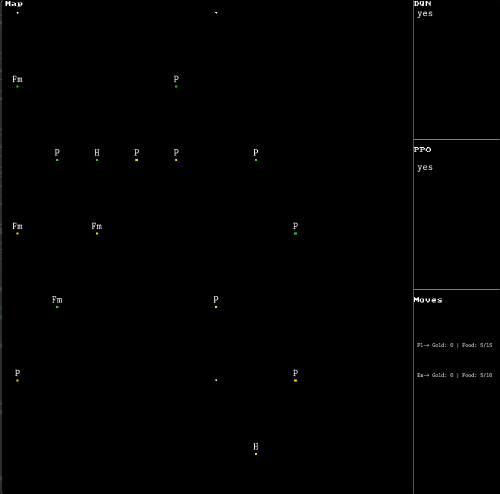

# Saya: Reinforcement Learning RTS Sandbox

Saya is a custom Real-Time Strategy (RTS) engine designed to benchmark and visualize Reinforcement Learning (RL)
algorithms specifically DQN and PPO in a dynamic multi-agent environment.

The project now utilizes SDL3 to visualize the agents decision-making in real-time. The goal is to
train an agent capable of competing against human players using RL strategies.



## Current State & Features

The engine is functional with the following systems implemented:

- **Core Tech Stack:** Built with C++17, integrated with PyTorch (LibTorch) for inference/training.
- **Visualization:** Real-time rendering using SDL3.
- **Algorithms:** Both DQN (Deep Q-Network) and PPO (Proximal Policy Optimization) training loops are implemented.
- **Replay System:** Custom serialization supporting two formats:
  - Binary (`.bay`) for performance.
  - String/Text (`.say`) for human readability.
  - Includes a GUI replay viewer to analyze agent movements.
- **Testing:** Fully integrated Catch2 unit testing framework.

## How to Contribute

Current priorities and areas needing improvement:

1. **Performance Optimization:**
   - *Current Issue:* Units currently manage their own cooldowns using multiple timers (approx. 3 per unit), creating overhead.
   - *Goal:* Refactor the cooldown system to use a centralized time-step manager or more efficient data structure.
2. **Tensor Input Shaping:** Refining how game state data is fed into the tensor model for better learning stability.
3. **Algorithm Tuning:** The training loops for DQN and PPO are functional but require tuning to resolve minor stability issues.

## Build & Usage

### Prerequisites
- **CMake** 
- **SDL3**
- **Catch2** 
- **FlameGraph** 
- **Perf**
- **PyTorch**

### Compilation
For the fastest setup, use the provided helper script. Ensure you generate the build files using the `-G` flag if doing this manually.

```bash
./compile.sh
```


### Profiling
Run the profiler script to get into optimizations
```bash
./profiler.sh
```
An .svg will be generated in the main directory, and you can view it using any .svg viewer including chrome.


